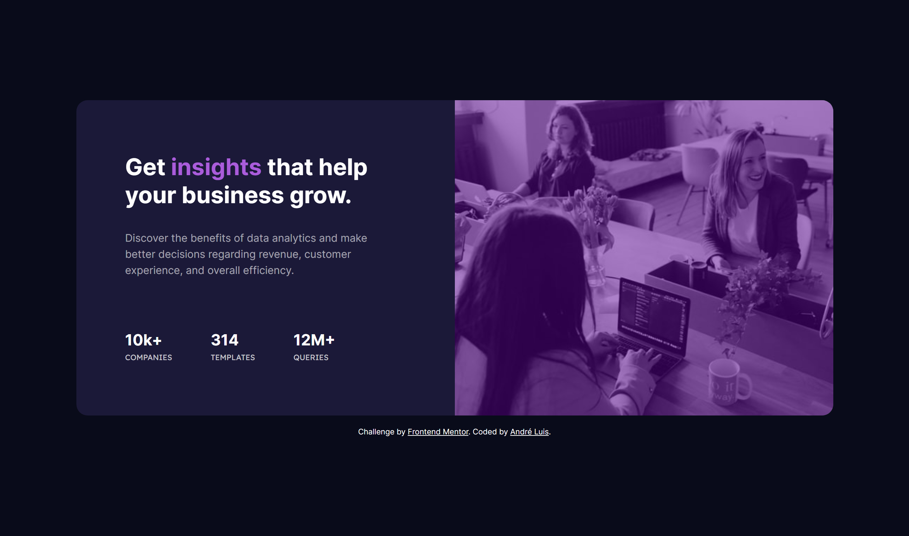

<h1 align="center"> Frontend Mentor - Stats preview card component solution </h1>

This is a solution to the [Stats preview card component challenge on Frontend Mentor](https://www.frontendmentor.io/challenges/stats-preview-card-component-8JqbgoU62). Frontend Mentor challenges help you improve your coding skills by building realistic projects.

 

  <a href="#-tecnologias">Tecnologias</a>&nbsp;&nbsp;&nbsp;|&nbsp;&nbsp;&nbsp;
  <a href="#-projeto">Projeto</a>&nbsp;&nbsp;&nbsp;|&nbsp;&nbsp;&nbsp;
  <a href="#-screenshots">Screenshots</a>&nbsp;&nbsp;&nbsp;|&nbsp;&nbsp;&nbsp;
  <a href="#-links">Links</a>&nbsp;&nbsp;&nbsp;

 

## 🚀 Tecnologias

Esse projeto foi desenvolvido com as seguintes tecnologias:

- HTML e CSS

## 💻 Projeto

O desafio era construir essa página de maneira responsiva (desktop e mobile). Para isso foi utilizado Display grid, flex e Media queries para controlar os tamanhos

## 📸 Screenshots

  
  

  

       

## 🌎 Links

- Solution: [https://www.frontendmentor.io/solutions/stats-preview-card-component-html-css-Q13xlk2HbV](https://www.frontendmentor.io/solutions/stats-preview-card-component-html-css-Q13xlk2HbV)
- Live Site: [https://stats-preview-card-aandreluis.netlify.app/](https://stats-preview-card-aandreluis.netlify.app/)

---
